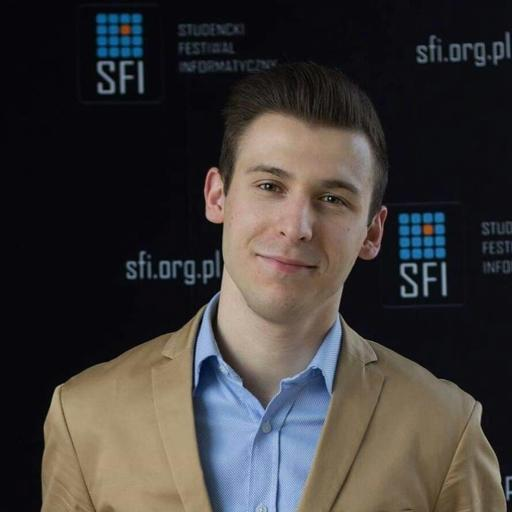

# BoostMyPhoto
Simple tool for photo boosting with Stable Diffusion.

## How the tool works?
User provides a photo, as well as text prompt describing on how to change it. Additionally, user
can define `transformation-strength` - value in range `(0.0; 1.0)` to determine how much to
transform image, as well as `prompt-importance` - the higher the value is (more distant from `1.0`) -
the more important the text input is for generating the output image.

### Example result

<table>
  <tr>
    <th>Description or text input prompt</th>
    <th>Image</th>
  </tr>
  <tr>
    <td>Original image (base for further transforms)</td>
    <td></td>
   </tr>
  <tr>
    <td>"Incredibly handsome man with sunglasses"</td>
    <td></td>
  </tr>
</table>


## Installation
```bash
pip install git+https://github.com/PawelPeczek/BoostMyPhoto.git
```

## Usage example


### Prerequisites
Once the tool is installed at your computer, you must log in into HuggingFace:
```bash
huggingface-cli login
```
And it is also required to navigate into
[runwayml/stable-diffusion-v1-5](https://huggingface.co/runwayml/stable-diffusion-v1-5) to accept
their usage terms and conditions.

### Command
```bash
boost_my_photo \
  --image_path /path/to/your/image.jpg \
  --text-prompt "Description on what to do with the picture" \
  --output_path /path/to/your/output_image.jpg \
  --transformation-strength 0.75 \
  --prompt-importance 7.5 \
  --device [cpu, cuda:0]
```


## Credits for model authors
```
@InProceedings{Rombach_2022_CVPR,
    author    = {Rombach, Robin and Blattmann, Andreas and Lorenz, Dominik and Esser, Patrick and Ommer, Bj\"orn},
    title     = {High-Resolution Image Synthesis With Latent Diffusion Models},
    booktitle = {Proceedings of the IEEE/CVF Conference on Computer Vision and Pattern Recognition (CVPR)},
    month     = {June},
    year      = {2022},
    pages     = {10684-10695}
}
```
